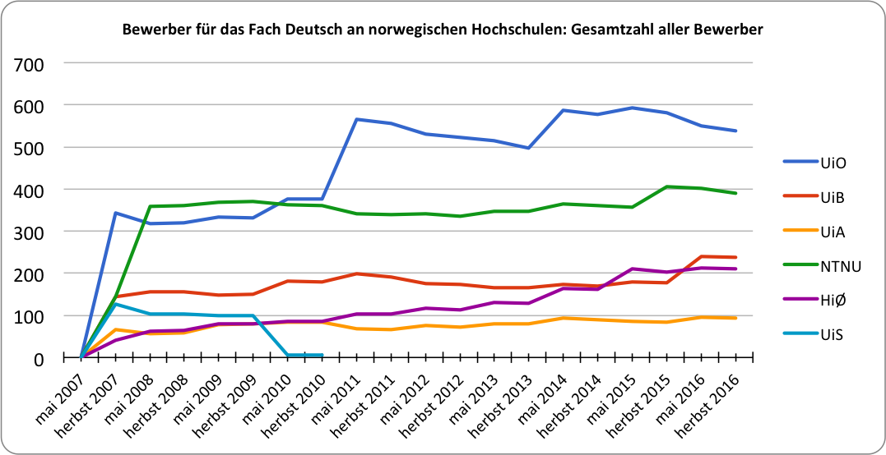

[Das Fach Deutsch an norwegischen Hochschulen]{.c22}

[Status quo und mögliche Zukunftsperspektiven]{.c21 .c23}

[Ziel dieses Beitrags ist es, einen kurzen Überblick über den
gegenwärtigen Zustand des Deutschstudiums in Norwegen zu geben und nach
dieser Bestandsaufnahme einige Vorschläge für eine mögliche künftige
Ausrichtung und Schwerpunktsetzung des Studienangebots zu
skizzieren.]{.c2 .c0}

[1. Historische Vorbemerkung]{.c16 .c7} {#historische-vorbemerkung .c4}
=======================================

[Das Studium der deutschen Sprache, Literatur und Kultur hat eine lange
Tradition in
]{.c0}[Norwegen]{.c0}^[\[a\]](#cmnt1){#cmnt_ref1}^[.]{.c0}^[\[1\]](#ftnt1){#ftnt_ref1}^[ Als
Universitätsfach mit vorrangig ]{.c0}[philologischer]{.c0 .c21}[ Prägung
wurde Deutsch an den großen Universitäten des Landes -- der Universität
Oslo und der Universität Bergen sowie der Norwegischen Lehrerhochschule
in Trondheim -- bis in die 1960er Jahre hinein unterrichtet (vgl.
Lindemann 2008, 105). In der Folge der bedarfsorientierten
Neuausrichtung des Lehrangebots vor allem auf den Beruf des
Deutschlehrers an Mittel- und Oberschulen (ungdomsskole, videregående
skole) wurden sowohl die bestehenden Studiengänge inhaltlich wie
personell erweitert, als auch mit den Regionalhochschulen in Østfold,
Agder, Stavanger, Volda und Tromsø neue Studienorte für Deutsch
etabliert.]{.c2 .c0}

[Seit den 1990er Jahren, die aufgrund demographischer Entwicklungen
einen besonders starken Studentenzuwachs -- auch im Fach Deutsch --
erlebten, ist die Zahl der Studierenden, die sich für ein Deutschstudium
entscheiden, stark rückläufig. Dies hat unter anderem dazu geführt, dass
vor allem an den Regionalhochschulen (die häufig gerade einen
Schwerpunkt in der Lehrerausbildung setzen), die Studienangebote für DaF
reduziert und mithin eingestellt worden sind.]{.c2 .c0}

[In ihrem 2008 erschienenen, den Stand von 2007 widerspiegelnden Beitrag
„Zur Entwicklung des Faches Deutsch an norwegischen Universitäten und
Hochschulen" konnte Beate Lindemann noch elf universitäre Einrichtungen
mit Deutschangeboten auflisten. Die Situation heute, 10 Jahre später,
sieht dagegen deutlich schlechter aus. Trotz vieler Universitäts- und
Hochschulneugründungen sowie einiger Fusionen in den letzten Jahren, ist
das universitäre DaF-Angebot stark geschrumpft. Nur noch an sechs
Hochschuleinrichtungen kann Deutsch studiert werden. Ich liste
nachfolgend die Studienstandorte mit den entsprechenden
Studienprogrammen auf.]{.c2 .c0}

[\[Einfügen etwas zum spezifischen Studienaufbau in Norwegen:
Årsstudium, B.A., M.A., PhD; Lektorprogramm\]]{.c2 .c0}

[2. Studienstandorte]{.c16 .c7} {#studienstandorte .c4}
===============================

[Universität Oslo (UiO)]{.c2 .c7} {#universität-oslo-uio .c4}
---------------------------------

[Die Universität Oslo ist die größte und zugleich die älteste und
traditionsreichste höhere Bildungseinrichtung in Norwegen. 1951 bis
]{.c0}[200x]{.c0 .c10}[ hatte sie ein eigenständiges „Institut für
Germanistik". Der Fachbereich Deutsch (tysk), der die Gebiete Deutsche
Sprache, Literatur und Kultur umfasst, ist jetzt in das „Institut für
Literatur, Gebietsstudien und Europäische Sprachen" (ILOS) integriert.
Deutsch ist mit sechs Professoren und einer schwankenden Zahl an
wissenschaftlichen Mitarbeitern personell noch immer recht gut
ausgestattet.]{.c0 .c2}

[Das Fach kann im Rahmen des 3jährigen Bachelor-Studiengangs (180 ECST)
„Europäische Sprachen" als Studienrichtung studiert werden. Daran kann
ein 2jähriges Master-Studium (120 ECTS) „Europäische Sprachen",
ebenfalls mit der Studienrichtung Deutsch, angeschlossen werden. Eine
Alternative bietet das sog. Jahresstudium (årsenhet) mit 60 ECTS,
welches im Rahmen anderer BA-Studiengänge sowie der Fort- und
Weiterbildung studiert werden kann. Das Jahresstudium deckt sich mit den
ersten zwei Semestern des BA-Studiengangs „Europäische Sprachen" (mit
der Studienrichtung Deutsch). Darüber hinaus kann Deutsch als Fach seit
kurzem auch innerhalb der 5jährigen Lehrerausbildung (lektorutdanning)
in der Studienrichtung „Fremdsprachen" gewählt werden. Hierbei entfallen
80 ECTS auf den Bereich Deutsch, der als Hauptfach zusammen mit einem
(fremdsprachlichen oder gesellschaftswissenschaftlichen) Nebenfach
gewählt werden kann.]{.c2 .c0}

[Es ist möglich, einzelne Seminare, Module oder Modulgruppen aus dem
Studienangebot Deutsch innerhalb anderer Studienfächer als sog. freie
Module mit 40 bis 80 ECTS zu belegen.]{.c2 .c0}

[Die Universität Oslo nimmt Doktoranden nur noch im Rahmen des von den
Fakultäten administrierten allgemeinen PhD-Programms auf, was mit einer
Anstellung als wissenschaftlicher Mitarbeiter auf Zeit (stipendiat), der
entweder einem der Institute oder einem der interdisziplinären
Forschungsteams zugeordnet ist, einhergeht. Es gibt daher kein
spezielles PhD-Programm für den Fachbereich Deutsch. Für die
obligatorische Ausbildungskomponente innerhalb des meist 3jährigen PhD
ist die Geisteswissenschaftliche Fakultät zuständig. Zur Zeit hat der
Fachbereich eine Doktorandin.]{.c2 .c0}

[Universität Bergen (UiB)]{.c2 .c7} {#universität-bergen-uib .c4}
-----------------------------------

[Die Universität Bergen, die seit den 1950er Jahren Deutsch als
Studiengang anbietet, ist gegenwärtig mit fünf Professoren und ebenso
vielen wissenschaftlichen Mitarbeitern und einer DAAD-Lektorin
verhältnismäßig gut ausgestattet und hat ein mit der UiO vergleichbares
Studienangebot Deutsch (Sprache, Literatur und Kultur). Angesiedelt ist
das Fach am „Institut für Fremdsprachen".]{.c2 .c0}

[Die UiB bietet ein 3jähriges BA-Studium Deutsch an (180 ECTS); an
dieses kann ein 2jähriges Master-Studium Deutsch (120 ECTS)
angeschlossen werden. Ebenfalls bietet die Universität das Jahresstudium
mit 60 ECTS an, das dem ersten Studienjahr im 3jährigen BA-Studium
entspricht. Im Rahmen der 5jährigen Lehrerausbildung mit der
Studienrichtung „Fremdsprachen" kann Deutsch (wie auch an der
Universität Oslo) als Fach studiert werden. Hierbei entfallen bei der
Wahl als Nebenfach 65 ECTS auf Deutsch, bei der Wahl als Hauptfach 85
ECTS. Obligatorisch sowohl für den BA Deutsch als auch das Jahresstudium
ist ein sechswöchiger Studienaufenthalt in Kiel, am Deutsch-Norwegischen
Studienzentrum (DNSZ) der Christian-Albrechts-Universität.]{.c2 .c0}

[Der BA-Studiengang „Sprache und Interkulturelle Kommunikation"
(auslaufend, zum Herbst 2017 keine Einschreibung mehr möglich) konnte
mit Deutsch als Schwerpunkt (150 ECTS) studiert werden.]{.c2 .c0}

[Vergleichbar mit der Universität Oslo ist auch an der Universität
Bergen die PhD-Ausbildung zentral von der Geisteswissenschaftlichen
Fakultät administriert. Die Doktoranden bewerben sich i.d.R. mit einem
freien Dissertationsprojekt bei der Fakultät, müssen bei der Bewerbung
jedoch angeben, welchem Fachbereich sie mit ihrem Projekt angehören
wollen. Z.z. hat der Fachbereich Deutsch an der UiB drei
Doktorandinnen.]{.c2 .c0}

[Universität Agder (UiA)]{.c2 .c7} {#universität-agder-uia .c4}
----------------------------------

[Die Universität Agder (vormals Regionalhochschule Agder) mit dem
Hauptcampus in Kristiansand ist eine relativ junge Universität mit vor
allem angewandten und Professionsstudiengängen, vorrangig im Bereich der
Lehrerausbildung. Mit zwei Professoren und einem wissenschaftlichen
Mitarbeiter ist das Fach Deutsch verhältnismäßig klein. Es ist an der
Fakultät für Geistes- und Erziehungswissenschaften angesiedelt.]{.c2
.c0}

[Deutsch kann an der UiA nur als Jahresstudium mit 60 ECTS oder im
Rahmen der 5jährigen Lehrerausbildung als Nebenfach studiert werden. Es
ist allerdings möglich, Module aus dem Bereich Deutsch im Rahmen anderer
Studiengänge zu belegen. Eine Kombination des Jahresstudium Deutsch mit
der 2jährigen Praktisch-Pädagogischen Ausbildung (PPU) ermöglicht den
Zugang zum Lehrerberuf.]{.c2 .c0}

[Bis 2015 konnte ein BA-Studium Deutsch aufgenommen werden. Aufgrund
rückläufiger Studienbewerberzahlen ist das BA-Studium bis auf Weiteres
eingestellt.]{.c2 .c0}

[Arktische Universität Tromsø (UiT)]{.c2 .c7} {#arktische-universität-tromsø-uit .c4}
---------------------------------------------

[An der „nördlichsten Universität der Welt" mit ihrem Hauptcampus in
Tromsø besteht das Fach Deutsch derzeit aus zwei Professoren und einer
wissenschaftlichen Mitarbeiterin.]{.c2 .c0}

[Im Zuge der Fusion der Universität Tromsø mit den Regionalhochschulen
in Narvik und Harstad 2016 und einer allgemeinen Neuprofilierung des
Studienangebots sind an der Geisteswissenschaftlichen Fakultät die
BA-Studiengänge „Sprache und Literatur" sowie „Sprache und Wirtschaft"
mit dem Schwerpunkt Deutsch eingestellt worden. Derzeit kann in Tromsø
lediglich ein Jahresstudium Deutsch mit 60 ECTS aufgenommen werden. Das
Jahresstudium lässt sich mit pädagogischen Studiengängen kombinieren und
ist für die Befähigung zum Deutschlehrer an Mittel- und Oberschulen
ausreichend. Die Wahl einzelner Module aus dem Bereich Deutsch innerhalb
anderer Studienfächer sowie als Weiter- und Fortbildungsstudium ist
ebenfalls möglich.]{.c2 .c0}

[Naturwissenschaftlich-Technische Universität Trondheim (NTNU)]{.c2 .c7} {#naturwissenschaftlich-technische-universität-trondheim-ntnu .c4}
------------------------------------------------------------------------

[Die Naturwissenschaftlich-Technische Universität Trondheim bietet seit
1961 (damals noch als „Norwegische Lehrerhochschule") ein Studium
Deutsch an. Mit fünf Professoren und 4 wissenschaftlichen Mitarbeitern
ist das Fach, das am „Institut für Sprache und Literatur" der
Geisteswissenschaftlichen Fakultät angesiedelt ist, recht gut
ausgestattet. Die NTNU trägt einen großen Anteil der (regionalen)
Lehrerausbildung, ist aber vor allem im
naturwissenschaftlich-technischen Bereich führend in Norwegen.]{.c2 .c0}

[Derzeit gibt es die Möglichkeit, Deutsch (Sprache, Literatur und
Kultur) im Rahmen eines 3jährigen BA-Studiengangs „Deutsch" mit 180 ECTS
zu studieren. Daran kann ein 2jähriges Master-Studium (120 ECTS)
„Deutsch" angeschlossen werden. Ein entsprechendes Jahresstudium mit 60
ECTS wird auch in Trondheim angeboten, insbesondere als Weiter- und
Fortbildungsprogramm sowie in Kombination mit anderen, besonders
pädagogischen Studiengängen, die dann zum Lehrerberuf an Mittel- und
Oberschulen befähigen. Auch hier deckt sich das Jahresstudium mit den
ersten zwei Semestern des BA-Studiengangs „Deutsch". ]{.c2 .c0}

[Bis zum Herbst 2016 wurde in Trondheim der BA-Studiengang
„Europastudien" mit Deutsch als Studienschwerpunkt angeboten. In diesem
sprach-, kultur- sowie vor allem politikwissenschaftlichen Studiengang
konnte Deutsch mit einem Umfang von 52,5 ECTS eingebracht werden.
Allerdings kann der Schwerpunkt „Deutsch" ab dem Studienjahr 2017/18
nicht mehr gewählt werden. ]{.c2 .c0}

[Die NTNU bietet im Rahmen der 5jährigen Lehrerausbildung indes die
Möglichkeit, Deutsch als Hauptfach (mit einem weiteren Nebenfach) im
Umfang von 165 ECTS zu studieren.]{.c2 .c0}

[Regionalhochschule Østfold in Halden (HiØ)]{.c2 .c7} {#regionalhochschule-østfold-in-halden-hiø .c4}
-----------------------------------------------------

[Die Regionalhochschule Østfold mit ihren beiden Studienstandorten in
Halden und Fredrikstad hat eine professionsorientierte Ausrichtung mit
einem Schwerpunkt in der Fort- und Weiterbildung sowie der
Lehrerausbildung. Aktuell bietet die Hochschule ein Jahresstudium im
Fach Deutsch (Sprache, Literatur und Kultur) im Umfang von 60 ECTS an.
Dieses kann, wie an den anderen Universitäten und Hochschulen, mit einer
pädagogisch-praktischen Ausbildung (PPU) verbunden werden und befähigt
zum Unterrichten im Fach Deutsch als Fremdsprache an Mittel- und
Oberschulen. ]{.c2 .c0}

[Alternativ kann Deutsch im Rahmen des 4jährigen MA-Studiengangs
„Fremdsprache in der Schule" in Teilzeit studiert werden (120 ECTS). Es
wird darüber hinaus die Möglichkeit geboten, ein Aufbaustudium „Deutsch"
im Umfang von 30 bis 70 ECTS zu absolvieren; das Fach kann zudem im --
dem ]{.c0}[Studium generale]{.c0 .c21}[ vergleichbaren -- BA-Studiengang
„Gesellschaft, Sprache und Kultur" mit mindestens 60, maximal 90 ECTS
(einer Kombination aus dem Jahresstudium Deutsch sowie dem
Aufbaustudium) studiert werden. Deutsch kann schließlich auch als
Wahlfach mit 40 ECTS im 3jährigen BA-Studiengang „Internationale
Kommunikation" belegt werden.]{.c2 .c0}

[Das Studienangebot Deutsch an der Regionalhochschule Østfold ist
netzbasiert, d.h. der größte Teil des Unterrichts findet online statt,
mit einigen wenigen Blockseminaren in Halden. Es richtet sich nicht
ausschließlich, aber vorzugsweise an bereits berufstätige Lehrer in
Norwegen und dem nordischen Ausland, die Deutsch als Zusatzqualifikation
erwerben oder ihre Deutschkenntnisse auffrischen wollen.]{.c2 .c0}

[Norwegische Handelshochschule (NHH)]{.c2 .c7} {#norwegische-handelshochschule-nhh .c4}
----------------------------------------------

[Die Norwegische Handelshochschule ist eine der ältesten höheren
Bildungseinrichtungen, die Deutsch in ihrem Studienprogramm haben. Seit
der Gründung 1936 wird Deutsch mit dem Schwerpunkt auf
Wirtschaftsdeutsch unterrichtet (vgl. Lindemann 2008, 111). Mittlerweile
ist Deutsch kein verpflichtender Teil des Betriebswirtschaftsstudiums an
der Handelshochschule mehr, wird jedoch in Form von drei Modulen --
„Wirtschaftsdeutsch I", „Wirtschaftsdeutsch II" sowie der „Einführung in
Wirtschafts- und Politikgeschichte der deutschsprachigen Länder" -- als
Wahlfach im Rahmen des 3jährigen BA-Studiengangs „Betriebswirtschaft"
angeboten.]{.c2 .c0}

[Zusammenfassung]{.c2 .c7} {#zusammenfassung .c4}
--------------------------

[Hatten 2007 noch elf norwegische Universitäten, Regional- und
Handelshochschulen Deutsch in Form vollumfänglicher Studiengänge auf BA-
und MA-Niveau oder als Zusatz-, Aufbau- oder Weiterbildungsstudium
angeboten, sind 2017 nurmehr sieben höhere Bildungseinrichtungen übrig,
die Deutsch in irgendeiner Form anbieten. Ausschließlich die
Universitäten in Oslo, Bergen und Trondheim ermöglichen ein
vollumfängliches Deutschstudium auf Bachelor sowie auf Masterniveau und
decken dabei sowohl Sprache, als auch Literatur und Kultur ab. Als
Jahresstudium oder im Rahmen der Lehrerausbildung kann Deutsch auch an
den Regionalhochschulen in Agder und Østfold sowie an der Arktischen
Universität Tromsø studiert werden. Lediglich als frei belegbares
Fremdsprachmodul kann Deutsch an der Norwegischen Handelshochschule in
Bergen sowie an der Regionalhochschule Østfold belegt werden.]{.c2 .c0}

[Die übrigen (Regional)Hochschulen in Stavanger (UiS), Volda (HiVolda),
Oslo und Akershus (HiOA) und das Betriebswirtschaftliche Institut in
Oslo (BI) haben heute kein Angebote für das Fach Deutsch mehr. Die neuen
Regionalhochschulen in Südostnorwegen (HSN) und Vestland (HVL) sowie die
Nordlands- (UiN) und die Inlandsuniversität (INN) bieten ebenfalls
keinen DaF-Unterricht an.]{.c2 .c0}

[Tendenziell schrumpfen die Studienangebote im DaF-Bereich auf das 60
ECTS umfassende Jahresstudium „Deutsch" zusammen, das sich sowohl in die
Lehrer-Aus- und weiterbildung integrieren, als auch mit anderen
Studienfächern kombinieren oder als Fortbildung berufsbegleitend
studieren lässt.]{.c2 .c0}

[\[Hinweis zum DNSZ in Kiel und den Möglichkeiten des Studiums im
deutschsprachigen Ausland\]]{.c2 .c0}

[\[wichtig!! Hinweis darauf, dass ein Deutschstudium zwar ohne
Vorkenntnisse aufgenommen, jedoch nur mit ausreichenden
Sprachkenntnissen aus der Mittel- und Oberschule erfolgreich studiert
werden kann. Keine Universität bietet Vorstudiensprachkurse oder
Einführungssprachkurse (mehr) an. Vgl. Tromsø Vorstudiensprachkurs und
Mgl. in Kiel zu studieren\]]{.c2 .c0}

[3. Studierendenzahlen im Fach Deutsch]{.c7 .c16} {#studierendenzahlen-im-fach-deutsch .c4}
=================================================

[Das Zentralregister "Samordna
opptak"]{.c0}^[\[2\]](#ftnt2){#ftnt_ref2}^[ erhebt seit 2007
Bewerberzahlen für alle öffentlichen Hochschulen und Universitäten in
Norwegen, aufgeschlüsselt nach Fächern. Ich habe für die Jahre 2007 bis
2016 die Bewerberzahlen sowie die Studienplatzangebote verzeichnet und
in einem Verlaufsdiagramm dargestellt.]{.c2 .c0}

[]{style="overflow: hidden; display: inline-block; margin: 0.00px 0.00px; border: 0.00px solid #000000; transform: rotate(0.00rad) translateZ(0px); -webkit-transform: rotate(0.00rad) translateZ(0px); width: 490.93px; height: 252.53px;"}

[Abb.  1 Gesamtzahl Bewerber für das Fach Deutsch an norwegischen
Universitäten und Hochschulen]{.c17}

[Im Erhebungszeitraum liegen Bewerberzahlen und Studienplatzangebote für
das Fach Deutsch nur von den Universitäten Oslo, Bergen, Agder,
Stavanger und Trondheim sowie der Regionalhochschule Østfold vor -- DaF
wird zwar auch an der Arktischen Universität Tromsø (UiT) und der
Norwegischen Handelshochschule (NHH) unterrichtet, da es dort kein
selbständiges Studienfach ist, jedoch nicht im Zentralregister
erfasst.]{.c2 .c0}

[Es zeigt sich, dass die
Gesamtanzahl]{.c0}^[\[3\]](#ftnt3){#ftnt_ref3}^[ der Studienbewerber für
DaF in den letzten 10 Jahren gestiegen ist: haben zum Studienjahr
2007/08 noch xx Bewerber Deutsch als Studienfach in Erwägung gezogen,
hat sich diese Zahl im Studienjahr 2016/17 ]{.c0}[yy]{.c0 .c10}[.
Vergleicht man diese Zahlen jedoch mit der Gesamtzahl aller
Studienbewerber]{.c0}[, ... \[Vermutung: im Verhältnis studieren weniger
DaF; Tendenz fallend\]]{.c0 .c10}[. ]{.c0}[Die generellen Zahlen in
Abb. 1 spiegeln nicht die tatsächliche Anzahl von Studienanfängern in
einem der Deutschfächer wieder, sondern sollen illustrieren, wie viele
Studienbewerber jährlich ein Deutschstudium überhaupt näher in Betracht
ziehen.]{.c0}^[\[b\]](#cmnt2){#cmnt_ref2}^[ Die tatsächlichen
Studierendenzahlen für DaF sind demgegenüber deutlich geringer, wie
Abb. 2 zeigt:]{.c2 .c0}

[]{style="overflow: hidden; display: inline-block; margin: 0.00px 0.00px; border: 0.00px solid #000000; transform: rotate(0.00rad) translateZ(0px); -webkit-transform: rotate(0.00rad) translateZ(0px); width: 490.93px; height: 255.87px;"}

[Abb.  2 Zugelassene Erstsemesterstudierende für das Fach Deutsch an
norwegischen Hochschulen]{.c17}

[Von den Studierenden, die sich für DaF als Erste-Wahl-Fach entscheiden,
wählt die Mehrheit (xx%) das Jahresstudium Deutsch; einen BA-Studiengang
belegen nur xx%. Für das Masterstudium liegen keine zentralen Zahlen
vor, erfahrungsgemäß sind die Studienanfängerzahlen jedoch niedriger als
in den BA-Studiengängen.]{.c2 .c0}

[\[Einfügen Grafik zu Verteilung der Bewerberzahlen auf BA und
Jahresstudium\]]{.c2 .c0}

[]{.c2 .c0}

[Ausblick]{.c16 .c7} {#ausblick .c4}
====================

[\[kürz, prägnant, paar Hinweise auf Tendenzen in HumMeld und FSS sowie
Zeitungs- und Magazinartikeln zu tysk i Norge sowie Tysklandstrategie
der Regierung etc.\]]{.c2 .c0}

[Das nationale Zentrum für Fremdsprachausbildung, Fremmedspråksenteret
hat für die Jahre
2012--2014,]{.c0}^[\[4\]](#ftnt4){#ftnt_ref4}^[ 2015/2016]{.c0}^[\[5\]](#ftnt5){#ftnt_ref5}^[ und
2016/2017]{.c0}^[\[6\]](#ftnt6){#ftnt_ref6}^[ eigene Erhebungen zu
Studien- und Examenszahlen vorgelegt. Die allgemeine Beobachtung ist,
dass eine deutlich geringere Anzahl Studienbewerber sich für das Fach
Deutsch an Universitäten entscheiden als das die Schülerzahlen an den
Mittel- und Oberschulen erwarten lassen würden. Deutsch gilt als
'kleines Sprachfach' an den Universitäten. Diese Beobachtung deckt sich
mit einer generell rückläufigen Anzahl Studierender in
Fremdsprachfächern (im Studienjahr 2015/16 haben in Norwegen nur 3%
aller Studienbewerber ein Sprachfach
gewählt)]{.c0}^[\[7\]](#ftnt7){#ftnt_ref7}^[, einzige Ausnahme sind das
Chinesische und das Japanische. Die relativ geringen Studierendenzahlen
in DaF haben zur Folge, dass wenige Deutschlehrer ausgebildet
werden...]{.c2 .c0}

[]{.c2 .c18}

------------------------------------------------------------------------

[\[1\]](#ftnt_ref1){#ftnt1}[ Einen historischen Überblick über die
norwegische Germanistik (vor allem an der Universität Oslo) bis in die
Mitte des 20. Jh. gibt Ottar Grønvik: Zur Geschichte der norwegischen
Germanistik bis 1950. In: Askedal, Jon Ole (Hg.): Germanistik und
Niederlandistik in Oslo. Beiträge zu Anlaß des 50-jährigen Bestehens des
Germanistischen Instituts der Universität Oslo. Frankfurt/Main 2003,
S. 9--21. Die Entwicklung bis in die 2000er Jahre werden bei Beate
Lindemann: Zur Entwicklung des Faches Deutsch an norwegischen
Universitäten und Hochschulen. In: ... 2008, S. 105--118 ab.]{.c12}

[\[2\]](#ftnt_ref2){#ftnt2}[ https://www.samordnaopptak.no/info/om/sokertall/
\[gesehen am 2. August 2017\]]{.c12}

[\[3\]](#ftnt_ref3){#ftnt3}[ Das Zentralregister listet alle Bewerber
auf, die Deutsch als Studienfach in ihrem Zulassungsantrag angegeben
haben. Hiervon geben die meisten Bewerber Deutsch als so genanntes
2.-Wahl Studienfach an, d.h., sie nehmen also nur dann ein
Deutschstudium auf, wenn sie für ihr 1.-Wahl-Fach nicht zugelassen
worden sind. Die Zahl der Bewerber mit Deutsch als 1.-Wahl-Fach ist
signifikant geringer (vgl. Grafik \#\#).]{.c12}

[\[4\]](#ftnt_ref4){#ftnt4}[http://www.fremmedspraksenteret.no/neted/services/file/?hash=aee824f8aad3e13bbbd34e1e9212b0af
(auf Norwegisch)]{.c12}

[\[5\]](#ftnt_ref5){#ftnt5}[http://www.fremmedspraksenteret.no/neted/services/file/?hash=4b00a0a06294db6647a32715cbea4907
(auf Norwegisch)]{.c12}

[\[6\]](#ftnt_ref6){#ftnt6}[http://www.fremmedspraksenteret.no/neted/services/file/?hash=2d6ece3f8a2f8d05d8ca4b69ff73eb5b
(auf Norwegisch)]{.c12}

[\[7\]](#ftnt_ref7){#ftnt7}[ Humanioramelding \[genaue
Seitenzahl\].]{.c12}

::: {.c13}
[\[a\]](#cmnt_ref1){#cmnt1}[\[ein paar Zahlen, vgl. Grønvik 2003 und
Lindemann 2008\]]{.c1}
:::

::: {.c13}
[\[b\]](#cmnt_ref2){#cmnt2}[Krude formuliert! Samordna opptak
registriert einmal alle Bewerber für DaF, unabhängig davon, ob DaF 1.
oder 2. Wahl ist. Zudem registert SO, wie viele Bewerber sich auf DaF
als 1. Wahl beworben haben sowie in einigen Jahren auch, wie viele
Bewerber einen Studienplatz angeboten bekommen haben. I.d.R. bekommen
alle 1.-Wahl-Bewerber auch einen Studienplatz zugeteilt, die Zahlen
decken sich also.]{.c1}

[Abb. 1 ist eher als eine Art \"Stimmungsbarometer\" zu verstehen; nur
Abb. 2 zeigt reale Bewerberzahlen für DaF, wobei nicht registeriert
wird, wie viele der Bewerber, die einen Studienplatz zugeteilt bekommen
haben, auch das Studium aufnehmen.]{.c1}

[Ausweislich der von der Regierung in Auftrag gegebenen
\"Humanioramelding\" vom 31.03.2017 schließen xx% der Studierenden in
den Geisteswissenschaft ihr Studium nicht oder nicht in Regelstudienzeit
ab. Wir können also davon ausgehen, dass von 10 Studienanfängern in
einem DaF-BA-Studienfach nur 6(?) einen Abschluss innerhalb der
Regelstudienzeit machen. Beim Jahresstudium liegt die Erfolgsquote bei
xx% \[gibts dazu Angaben? Falls nicht: Stichprobe UiO\].]{.c1}
:::
